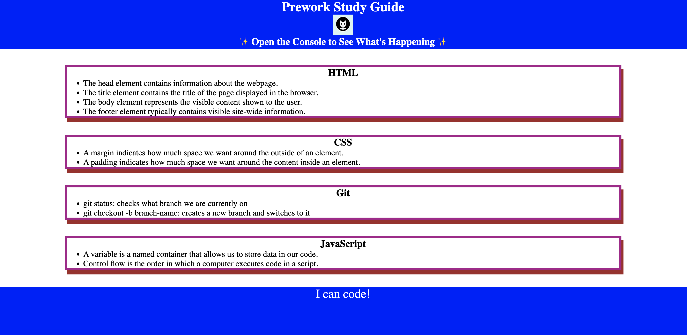

# UCBxBC Prework Study Guide Webpage

## Description

Here is where I am devepoling a Prework Study Guide application. I've worked in IT for a long time but never pursued certifications let alone participated in a coding bootcamp. I find it very interesting and informative. Most of which is how the course is filling in the gaps in my knowledge of web development. Being able to build even a simple web application from scratch has been motivating. I hope what I've accomplished so far will be an example to others that it's never too late to learn something new.

## Table of Contents

- [Usage](#usage)
- [Credits](#credits)
- [License](#license)

## Usage

Just browse to https://mycomplex.github.io/prework-study-guide/

  

## Credits

[UC Berkeley Extension](https://extension.berkeley.edu/), [EdX](https://www.edx.org/)

## License

Licensed under the [MIT](LICENSE.txt) license.